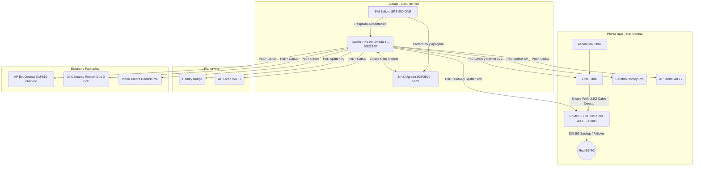

# Memoria del Proyecto: Fortaleza de Confort Invisible y Resiliencia Activa
## Residencia Rural Calzada de Oropesa (Toledo)

Este documento constituye la memoria técnica y el historial completo del proyecto de domótica avanzada y redes de alta disponibilidad. Ha sido creado en el directorio de trabajo para servir como **memoria persistente**. Cualquier agente de IA o desarrollador que abra esta carpeta en el futuro podrá leer este documento y estar plenamente al tanto del contexto, las decisiones de diseño, los innegociables técnicos y las correcciones de software realizadas desde la primera conversación.

---

## 1. Ficha del Proyecto y Dinámica de Ocupación

*   **Ubicación:** Calzada de Oropesa (Toledo, España). Entorno rural con clima continental extremo (verano caluroso >40ºC, invierno frío) y red eléctrica propensa a microcortes y fluctuaciones.
*   **Propiedad:** Vivienda unifamiliar de 160 m² dividida en 2 plantas (aprox. 80 m² por planta) construida en una parcela rectangular de 20x15m. Cuenta con un garaje adosado a la izquierda (25 m²) y un patio/jardín a la derecha (75 m²).
*   **Características Constructivas (Actualización):** Estructura sumamente transparente a radiofrecuencias (RF) en su interior: tabiquería interna de ladrillo hueco sencillo de 5 cm (yeso) y forjado de separación entre plantas abierto en el centro por el hueco de la escalera. Fachada exterior de ladrillo de 30 cm de espesor con cámara de aire y aislante térmico. No existen muros interiores de piedra. Actualmente en fase de reformas.
*   **Usuarios:** Segunda residencia familiar para 6 adultos (padres jubilados, 2 hijos y 2 nueras).
*   **Dinámica de Visitas:** Estancias recurrentes pero cortas (típicamente hasta 4 días de duración), distribuidas principalmente en primavera y verano. Ausencias prolongadas que no superarán el mes en otoño e invierno.
*   **Prioridad Crítica Nº 1:** **Seguridad perimetral y física** (ante riesgos específicos de intrusión por bandas locales que vigilan viviendas vacías).
*   **Prioridad Nº 2:** **Confort Invisible** (70% confort / 30% eficiencia energética). Automatizaciones en segundo plano que no requieran que los usuarios (especialmente los mayores) interactúen con aplicaciones complejas.

---

## 2. Respuestas Estratégicas y Definición de Objetivos (NotebookLM)

El diseño se cimenta sobre las respuestas del usuario al interrogatorio estratégico inicial:
1.  **Hábitos de ocupación:** Visitas de fin de semana y vacaciones. Se prioriza la **pre-climatización predictiva basada en geofencing** para que la vivienda esté a temperatura de confort (inercia térmica controlada) antes de la llegada de la familia desde Madrid.
2.  **Seguridad perimetral:** El control de accesos se segmenta en dos barreras (Valla Exterior Peatonal y Puerta de Entrada Principal) con cerraduras seguras y videovigilancia local 24/7 sin cuotas.
3.  **Presupuesto y Prioridades:** 70% Confort / 30% Eficiencia. Se prefiere invertir en hardware robusto de grado industrial (Z-Wave 800, cableado Cat6A, contactores) antes que en soluciones de consumo básico.
4.  **Gestión de Pozos:** Control de nivel analógico en los dos pozos freáticos de la finca para riego y piscina, protegiendo las bombas contra el funcionamiento en vacío (cavitación/dry-run).

---

Dado que la seguridad y el control remoto desde Madrid dependen al 100% de la red local, se implementa una infraestructura sin fisuras en estrella cableada:



### Componentes Clave y Justificación de Cambios:
*   **Router Central: GL.iNet Spitz AX (GL-X3000) en Hall de Planta Baja**
    *   *Justificación:* Ubicado en el centro de la vivienda (Hall/pasillo). Esto optimiza la recepción celular 5G interna y permite el fácil acceso físico a la ONT y router. Al estar conectado por cable directo Cat6A troncal al Switch en el garaje, actúa como pasarela LAN sin pérdidas.
    *   *Configuración:* Su WiFi interno se configura como **desactivado (WiFi OFF)** para no interferir con las antenas gestionadas simétricas y evitar el roaming asimétrico.
*   **Switch de Distribución: TP-Link Omada (TL-SG2218P) en el Garaje**
    *   *Justificación:* Concentra todas las conexiones de la casa en estrella en el armario rack del garaje, manteniéndolas protegidas físicamente y aisladas del ruido.
    *   *Uso:* Alimenta de forma centralizada todos los APs, cámaras, videotimbres y los splitters PoE de los cerebros Homey mediante cables Cat6A independientes.
*   **Almacenamiento NAS: 4TB útiles en RAID1 (8TB Físicos en total) en el Garaje**
    *   *Suficiencia:* Plenamente suficiente. Al grabar 24/7 en alta resolución, las 3 cámaras consumen unos 388 GB/día, dando **10 días completos de historial**. Si se optimiza para grabar en baja resolución y conmutar a 16MP mediante detección de movimiento IA, el consumo baja a 100-150 GB/día, ampliando la retención a **entre 25 y 40 días**, cubriendo holgadamente las ausencias mensuales.
*   **SAI (UPS): Salicru SPS 900 ONE (900VA/480W) en el Garaje**
    *   *Gestión Inteligente:* Ante cortes eléctricos, el software **ViewPower** (conectado por USB al NAS Ugreen) inicia un apagado seguro inmediato de los discos del NAS. La energía restante del SAI se reserva exclusivamente para el Switch del garaje. Al estar tanto el router Spitz AX como la ONT en el Hall alimentados directamente por PoE a través del switch, ambos se benefician del respaldo del SAI, garantizando que la conexión a internet y las alertas celulares sigan activas sin interrupciones durante el apagón.
    *   *Alerta Térmica Rural:* Las baterías de plomo sufren degradación extrema por encima de los 40ºC. El Rack de 19" en el garaje **exige ventilación activa termostática**. Si el garaje supera de continuo los 40ºC en verano, el núcleo de red y el SAI deberán ser reubicados en el interior habitable.

### 3.1. Análisis de Upgrade a WiFi 7 (6GHz) y Comparativa de Ecosistemas

#### 1. Razonamiento de "Todo de la misma marca" (Ecosistema Unificado)
*   **LAN y WLAN (Switch + APs): INNEGOCIABLE.** Para la red interna cableada e inalámbrica, el uso de una única marca es vital. La integración bajo una misma plataforma SDN (Software-Defined Networking) como TP-Link Omada o Ubiquiti UniFi permite que un **controlador central** gestione la itinerancia o **roaming activo (802.11k/v/r)**. Esto asegura que al moverte de la planta baja a la alta, o al patio, tus dispositivos (teléfonos, tablets, WallPanel) cambien de punto de acceso en milisegundos de forma totalmente transparente y sin microcortes. Además, simplifica drásticamente la configuración de múltiples VLANs (Domótica, Privada, Invitados, Cámaras) que deben propagarse de forma consistente en switches y APs.
*   **Enrutamiento WAN (El Router Central): LA EXCEPCIÓN RECOMENDADA.** El router es el extremo del sistema. Su función es negociar la IP pública con la operadora (PPPoE VLAN 6) y manejar el failover celular en caso de caídas. Para una residencia rural como la tuya en Toledo, el **GL.iNet Spitz AX (GL-X3000)** es la mejor opción industrial de mercado por su ranura SIM integrada, soporte para antenas externas 5G y versatilidad VPN.
    *   *¿Mezclar marcas provoca fallos?* **No.** El router no participa en la negociación de roaming de los clientes WiFi (que se da de forma autónoma entre las antenas y el switch/controlador). Que el Spitz AX sea de una marca diferente al switch y las antenas no introduce ningún microcorte de red local. Por tanto, la excepción de usar un router especializado (GL.iNet) combinado con distribución unificada (Omada o UniFi) es el diseño óptimo.

#### 2. Necesidad de la Banda de 6GHz (WiFi 6E y WiFi 7)
*   **Mito vs. Realidad Domótica:** Los dispositivos de domótica estándar (relés Shelly, bombillas, enchufes Zigbee) **no operan ni operarán en 6GHz**. El 100% de la domótica inalámbrica WiFi de consumo masivo funciona en la banda de **2.4 GHz** (por su enorme alcance y bajo coste de fabricación) o en sub-GHz (Z-Wave a 868 MHz en Europa, que es físicamente inmune a interferencias de WiFi).
*   **El beneficio indirecto (Descongestión):** La banda de 6GHz tiene un ancho de banda masivo y canales ultra-anchos libres de interferencias. Al migrar los dispositivos de alta demanda de datos de la familia (móviles, portátiles, consolas, NAS en streaming, Smart TVs) a la banda de 6GHz (o 5GHz), **liberas la banda de 2.4 GHz por completo**. Al haber menos tráfico en 2.4GHz, se reducen drásticamente las colisiones de paquetes y las latencias, permitiendo que la domótica basada en WiFi y en Zigbee (que también trabaja en 2.4GHz) funcione de forma sumamente fluida y estable.
*   **Física del Hogar (Calzada de Oropesa):** La casa tiene tabiques interiores de ladrillo hueco de 5 cm y un hueco de escalera central abierto. Esta estructura es sumamente permeable a radiofrecuencias. Sin embargo, la fachada exterior es de ladrillo de 30 cm con cámara y aislamiento. Las ondas de 6GHz tienen una atenuación física altísima al atravesar obstáculos macizos. Esto significa que **el WiFi de 6GHz brillará con un rendimiento espectacular en el interior habitable**, pero no atravesará las paredes exteriores hacia el patio ni el garaje, donde la conexión de los clientes domóticos y móviles se apoyará, de forma correcta, en las bandas de 2.4 y 5 GHz de alta penetración.

#### 3. Comparativa de Opciones (A vs. B) en Escenario Central
*   **Opción A (1 Router 5G en Hall Central con WiFi OFF + 2 APs de techo interiores simétricos + 1 AP outdoor): LA ELECCIÓN RECOMENDADA PARA MÁXIMA ROBUSTECEZ.**
    *   *Justificación:* El router central Spitz AX y la ONT se ubican físicamente en el Hall/pasillo de la Planta Baja. Aunque esta posición geométrica es ideal para dar WiFi, mantener activo su WiFi (Opción B) genera un problema grave de **asimetría de marcas y falta de itinerancia coordinada**.
    *   *El problema de roaming:* Si usas el WiFi del Spitz AX (GL.iNet) para la Planta Baja y un AP Omada (o UniFi) para la Planta Alta, los dos dispositivos **no comparten un controlador común para coordinar el Roaming Rápido (802.11k/v/r)**. Cuando camines hacia la planta alta, tu móvil sufrirá el efecto "cliente pegajoso" (sticky client): se negará a soltarse del router de la planta baja hasta que la señal sea casi inexistente, provocando **microcortes** de red.
    *   *Ventaja de Opción A:* Desactivar el WiFi del Spitz AX y colocar dos APs de techo idénticos de la misma marca (Omada o UniFi) en Planta Baja y Planta Alta. El controlador SDN coordinará de forma transparente los cambios de antena, garantizando una transición impecable de menos de 50ms, además de automatizar la propagación de VLANs sin tener que duplicar configuraciones en dos sistemas operativos distintos.
*   **Opción B (1 Router 5G activo en Hall + 1 AP en Planta Alta + 1 AP outdoor): DESCARTADA por colisiones y microcortes.**
    *   Obliga a mezclar dos marcas/sistemas de WiFi (GL.iNet y Omada/UniFi). Estéticamente, el router Spitz AX sobre una consola de pasillo tiene antenas de varilla que propagan el WiFi a nivel de suelo/cuerpo, expuesto a la atenuación de personas y muebles. Los APs de techo dedicados (Opción A) propagan de forma toroidal limpia desde la parte superior, libre de obstáculos físicos.

#### 4. Propuestas de Conjuntos de Equipos por Ecosistema

```carousel
### Conjunto 1: TP-Link Omada WiFi 7 (Máxima Calidad-Precio)
Este conjunto conserva tu Switch TL-SG2218P y el AP Exterior actual, pero eleva los APs interiores a Wi-Fi 7 (6GHz) con el nuevo EAP773.

*   **Enrutador 5G (Edge):** GL.iNet Spitz AX (GL-X3000) [~390 €]. Ubicado en el Hall de la planta baja, alimentado mediante PoE+ Splitter a 12V DC directo desde el switch del garaje. Su WiFi interno está desactivado.
*   **Alimentación ONT:** Alimentada en el Hall mediante PoE Splitter a 12V DC directo desde el switch del garaje. De esta forma, ONT y Router están respaldados por el SAI.
*   **Switch Troncal:** TP-Link Omada TL-SG2218P (16 puertos Gigabit PoE+, 150W budget) [~220 €]. Ubicado en el rack del garaje.
    *   *Análisis PoE:* Carga total de red con APs, cámaras, WallPanel, Homey Pro/Bridge y la adición del Spitz AX + ONT es de ~128W típicos y ~142W de pico teórico simultáneo. Encaja con un margen seguro bajo el presupuesto de 150W del switch.
*   **Puntos de Acceso Interiores (2x):** TP-Link Omada EAP773 WiFi 7 Tri-band (BE11000) [~210 €/unidad, total ~420 €]. Uno en techo de planta baja (Hall/pasillo) y otro en planta alta, alimentados por cable Cat6A PoE+ directo desde el garaje.
    *   *Alimentación:* Soportan alimentación PoE+ (802.3at) con consumo máximo de 24W por puerto (total ~48W).
*   **Punto de Acceso Exterior (1x):** TP-Link Omada EAP610-Outdoor WiFi 6 (IP67) [~130 €]. Cobertura en patio y piscina a 2.4/5 GHz de alta potencia.
*   **Controlador:** Software Omada Controller gratuito autohospedado en tu NAS Ugreen DXP2800 (en contenedor Docker/LXC), evitando comprar un controlador físico OC200 y centralizando la gestión.

**Presupuesto Estimado de Red:** **~1.160 €** (incluyendo Router a precio de España de 390 €, Switch y 3 APs).
*Pros:* Escalabilidad, costes contenidos, software de gestión gratuito local en NAS, excelente presupuesto de potencia PoE (150W).
*Contras:* Los puertos del Switch TL-SG2218P son Gigabit; para aprovechar la velocidad de 2.5G/10G física entre APs y NAS, se requeriría un switch Multi-Gigabit más costoso.
<!-- slide -->
### Conjunto 2: Ubiquiti UniFi WiFi 7 Premium (Multi-Gigabit Extremo)
Ecosistema de gama alta que implementa enrutamiento de 2.5 Gbps en toda la red interna y gestión visual líder en el mercado.

*   **Enrutador 5G (Edge):** GL.iNet Spitz AX (GL-X3000) [~390 €]. Configurado en modo puente (IP Passthrough) alimentando la WAN del controlador principal. Ubicado en el Hall de planta baja y alimentado mediante PoE+ Splitter a 12V DC.
*   **Alimentación ONT:** Alimentada en el Hall mediante PoE Splitter a 12V DC.
*   **Controlador y Enrutador Local:** UniFi Cloud Gateway Max (UCG-Max) [~220 €]. Ubicado en el rack del garaje. Aloja localmente el sistema operativo UniFi, gestiona las VLANs y cuenta con todos sus puertos a **2.5 Gbps**. Incluye ranura SSD para grabación de NVR.
*   **Switch Troncal:** UniFi Switch Pro Max 16 PoE [~340 €]. Ubicado en el rack del garaje. Dispone de 4 puertos a 2.5 Gbps PoE+, 12 puertos 1G (8 PoE+ y 4 no PoE) y 2 puertos SFP+ a 10G. Presupuesto PoE de 120W.
    *   *Análisis PoE (¡Punto Crítico!):* La carga total proyectada con APs, cámaras, WallPanel, Homey Pro/Bridge y la adición del Spitz AX + ONT se sitúa en ~128W típicos y ~142W de pico teórico simultáneo. El switch UniFi solo ofrece **120W** de presupuesto, lo que significa que el switch estaría operando en sobrecarga constante y crítica incluso bajo consumo típico, y superaría ampliamente su capacidad en los picos nocturnos, provocando caídas de puertos o reinicios automáticos. Exigiría de forma obligatoria añadir inyectores PoE+ individuales en el garaje para descargar al switch.
*   **Puntos de Acceso Interiores (2x):** UniFi U7 Pro WiFi 7 Tri-band (BE9300) [~190 €/unidad, total ~380 €]. Uno en techo de planta baja (Hall/pasillo) y otro en planta alta, alimentados por cable Cat6A PoE+ directo desde el garaje.
    *   *Alimentación:* Requieren PoE+ (802.3at) con consumo máximo de 21W.
*   **Punto de Acceso Exterior (1x):** UniFi U6 Outdoor WiFi 6 [~150 €] o UniFi U7 Outdoor.
*   **Presupuesto Estimado de Red:** **~1.480 €**.
*Pros:* Puertos nativos a 2.5 Gbps en switch, APs y controlador; rendimiento de red interna extremo para backups hacia el NAS y transferencias; interfaz de usuario sumamente pulida y atractiva.
*Contras:* Inversión significativamente superior (~40% más costosa), presupuesto PoE muy ajustado (120W) que obliga a inyectores externos.
```

---

## 4. Doble Barrera de Control de Accesos y Seguridad Perimetral

### Barrera 1: Valla Peatonal del Muro Exterior
*   **Hardware:** Abrepuertas eléctrico de 12V AC/DC en contacto seco permanente + transformador de carril DIN 230V a 12V + relé **Shelly Plus 1** configurado en modo **Momentary** con **Auto Off tras 2 segundos**.
*   **Operativa:** Al pulsar el Video Timbre Reolink PoE en la valla, la señal viaja localmente a Homey Pro, que despierta el **Wall Panel Geekland** del pasillo (vía Fully Kiosk API). En la pantalla se pulsa el botón *"Abrir Puerta Exterior"* para dar paso al jardín.

### Barrera 2: Entrada Principal de la Vivienda
*   **Cerradura:** **Nuki Smart Lock Pro (5.ª Generación)** ya en propiedad del usuario.
*   **Innegociable Técnico:** Obligatoria instalación de un **cilindro de alta seguridad de doble embrague**. Permite abrir físicamente con llave tradicional desde fuera en caso de fallo electrónico, batería agotada o bloqueo lógico.
*   **Acceso Familiar:** Se instala el **Nuki Keypad 2.0** en el exterior para entrada biométrica por huella dactilar (ideal para evitar que familiares mayores luchen con llaves o el móvil).
*   **Integración:** Conectada localmente a Homey Pro por **Matter-over-Thread** para una respuesta instantánea (<1s) y total autonomía offline.

---

## 5. Diseño del Cuadro Eléctrico Inteligente Monofásico

Ubicado en el garaje de la vivienda en carril DIN, utiliza protecciones y relés profesionales cableados con secciones seguras:

1.  **Diferencial Auto-rearmable (Circutor REC4):** Asegura que ante caídas intempestivas de diferencial (humedad del riego, tormentas en Toledo), la vivienda recupere el suministro en 3 segundos, protegiendo la nevera, el router y la seguridad.
2.  **Protector contra Sobretensiones (Toscano Combi-PRO):** Blindaje contra subidas de tensión permanentes de la distribuidora y transitorias (rayos).
3.  **Medidor Shelly Pro 3EM (Monofásico):** Medición con tres pinzas amperométricas: Pinza A (Consumo General), Pinza B (Fuerza Pozo 1), Pinza C (Fuerza Pozo 2).
4.  **Desvío de Excedentes Fotovoltaicos (Termo ACS):** Termo de 3kW controlado por un **contactor industrial de 25A** accionado por un **Shelly Pro 1** en carril DIN. La medición de carga la realiza un **Shelly Pro EM-50** dedicado. Homey Pro regula el encendido según la telemetría del inversor Huawei FusionSolar.
5.  **Control de Motores de Pozos (Shelly Pro 2 + 2x Contactores de 25A):** Los motores de las bombas tienen picos inductivos de arranque que quemarían relés comunes. Los Shelly Pro 2 comandan únicamente las bobinas (A1-A2) de los contactores de 25A, a través de los cuales fluye la potencia hacia las bombas.
6.  **Sonda de Nivel Hidrostático (Sonda TL-136 + Shelly Plus Uni + Buck Converter):** Para evitar que el Shelly Plus Uni se dañe debido a fluctuaciones eléctricas del entorno rural, se instala un **convertidor DC-DC (Buck Converter)** para estabilizar a 12V la tensión de alimentación de la placa. La sonda analógica lee el nivel freático y Homey Pro corta la bomba al instante si baja del 15% (Protección contra cavitación / Dry-Run).

---

## 6. Lógica de Riesgos Críticos en Homey Pro

Toda la lógica de emergencias se ejecuta localmente y offline en Homey Pro:
*   **Incendios en Falso Techo:** Ante detección de humo/CO por sensores Zigbee en salón o pasillo, Homey Pro envía por API Local HTTP un comando a la pasarela **Airzone Webserver HUB** para **cerrar al 0% todas las rejillas proporcional motorizadas (Airzone Rint)** y apaga los climatizadores de conductos. Esto evita que los ventiladores esparzan los humos tóxicos entre estancias a través de los techos técnicos mientras la familia duerme.
*   **Fugas de Agua:** Si los sensores de inundación detectan agua en cocina, baños o bandeja de condensados de la aerotermia, Homey Pro corta la **Electroválvula General de Agua (12V/230V)** en menos de 2 segundos.
*   **Geofencing Inteligente (Sin Falsos Positivos):**
    *   *Entrada:* Al salir de Madrid y cruzar el radio de **2 km** (sentido Entrante), se activa la pre-climatización de la aerotermia. Al cruzar el radio estrecho de **100 m** Y confirmarse la conexión Bluetooth/WiFi del móvil al AP exterior Omada, se abre la valla y el garaje de forma automatizada.
    *   *Salida:* Al cruzar el radio en sentido Saliente, el automatismo de apertura se bloquea inmediatamente para evitar aperturas accidentales por paseos dentro de la finca.

---

## 7. Instrucciones Urgentes de Obra para el Electricista

Para aprovechar la fase actual de enyesado y tabiquería, se deben cumplir tres innegociables físicos:
1.  **Neutro Obligatorio:** Debe llevarse cable Neutro (azul) a **todos los cajetines de interruptor de la casa** para poder instalar micromódulos Shelly ocultos detrás de las teclas.
2.  **Cajas de Mecanismos Profundas (Seguridad Crítica):** Exigir cajetines de mecanismos con profundidad de **mínimo 60 mm (preferiblemente 65 mm)**. Queda **terminantemente prohibido el uso de cajetines estándar de 40 mm**, ya que el aplastamiento físico del micromódulo Shelly contra el fondo de la caja representa un severo riesgo de fatiga mecánica, sobrecalentamiento e incendio por arco eléctrico.
3.  **Cableado Estructurado Blindado PoE:**
    *   Tiradas de interior cercanas a cables de fuerza: Cable **Cat6A F/UTP** blindado para evitar interferencias.
    *   Tiradas de exterior (Cámaras, Videotimbre, AP Exterior): Cable **Cat6A SF/UTP con chaqueta de Polietileno (PE)** resistente a la intemperie y al sol de Toledo, con **conectores STP metálicos**. El blindaje del conector debe derivarse a tierra física a través del chasis del switch TP-Link Omada en el garaje.

---

## 8. Arquitectura del Panel Interactivo (Dashboard Web)

La interfaz de usuario y panel técnico de esta solución ha sido desarrollada en Vanilla HTML, CSS y Javascript bajo una estética premium y dinámica, adaptada a un **diseño claro (Light Theme)** con alto contraste.

### Estructura del Código:
*   [index.html](file:///C:/Users/cotin/.gemini/antigravity/scratch/domotica-calzada/index.html): Documento principal que estructura el Dashboard con barra de navegación lateral y pestañas enriquecidas con SVG interactivos del plano conceptual de la casa y del esquema eléctrico DIN.
*   [styles.css](file:///C:/Users/cotin/.gemini/antigravity/scratch/domotica-calzada/styles.css): Sistema de diseño claro HSL unificado, transiciones fluidas, animaciones dinámicas de flujo eléctrico (`stroke-dasharray` en cables) y estilos adaptados a pantallas táctiles.
*   [app.js](file:///C:/Users/cotin/.gemini/antigravity/scratch/domotica-calzada/app.js): Control lógico del Dashboard, cambio dinámico de pestañas, comportamiento interactivo al hacer hover/click sobre los componentes SVG (tanto en el plano como en el cuadro), calculadora de autonomía del SAI/UPS basada en carga, sumador interactivo de presupuesto y bloc de notas autoguardado en `localStorage` con exportador de texto plano.

---

## 9. Registro de Bug Fixes Críticos (Mayo 2026)

Se han corregido cuatro fallos críticos en la interfaz del panel interactivo para garantizar un funcionamiento impecable:

1.  **Títulos Invisibles Corregidos:** Se eliminaron las reglas inline `color: white` en las tarjetas de la pestaña de Accesos y Seguridad, que causaban invisibilidad al renderizar con el tema claro. Ahora heredan dinámicamente el color `--text-primary` de alto contraste.
2.  **Botón Copiar Reposicionado:** El botón de copia de credenciales PPPoE (`#btn-copy-creds`) ha sido recolocado de forma absoluta dentro de su bloque contenedor oscuro `.code-container`. Esto soluciona la superposición que sufría con el título de la tarjeta y añade un icono de portapapeles consistente con la UI.
3.  **Estabilización del Plano Conceptual (Fin del Jitter/Vibración):** Los círculos numerados del plano conceptual sufrían una vibración violenta ("jitter") al situar el cursor encima. Esto sucedía porque al cambiar el radio del círculo `<circle>` en hover (de 19px a 20px), las propiedades de CSS `transform-box: fill-box`, `transform-origin: center` y la transición sobre `transform` forzaban un recalculo infinito del centro del grupo `<g>`, creando un bucle físico de entrada/salida del cursor.
    *   *Solución:* Se eliminaron las transiciones de transformación sobre el grupo `.svg-node` y `.panel-node`. Ahora, el cambio de tamaño del círculo se realiza mediante la transición nativa de su radio `r` en CSS sin alterar el grupo raíz, logrando un escalado limpio, estático e instantáneo sin vibración.
4.  **Habilitación de Páginas Vacías (Balanceo HTML):** Las secciones "Cuadro Inteligente", "Plan de Presupuesto", "Justificación de Equipos" y "Bloc de Planificación" aparecían completamente en blanco.
    *   *Diagnóstico:* En la pestaña 5 de Accesos (`tab-access`), faltaba la etiqueta de cierre `</div>` del contenedor flex. Esto provocaba que todas las pestañas siguientes se anidaran de forma errónea dentro de la sección oculta de Accesos. Al estar esta oculta por CSS, el navegador ocultaba todo el resto del documento.
    *   *Solución:* Se cerró correctamente el `div` de la sección y se validó el balanceo HTML en todo el archivo, incluyendo la etiqueta `<tbody>` omitida en la tabla de equipamiento. El Dashboard es ahora 100% visible, interactivo y accesible.

---

Este historial y memoria técnica garantiza la continuidad y el éxito de cualquier desarrollo futuro en el ecosistema **Fortaleza de Confort Invisible** en Calzada de Oropesa.
